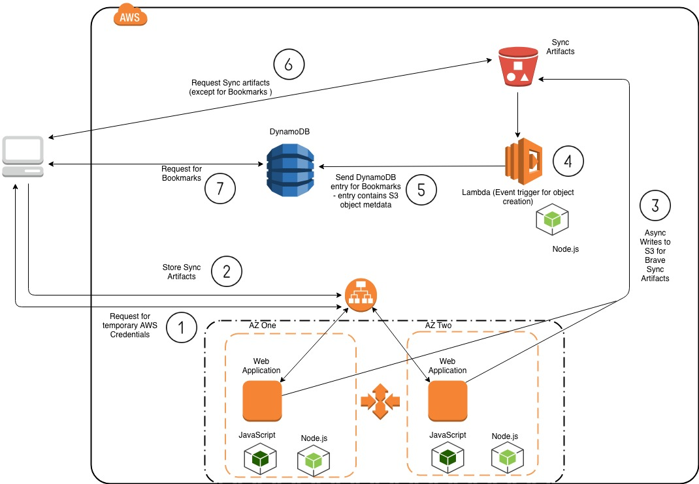
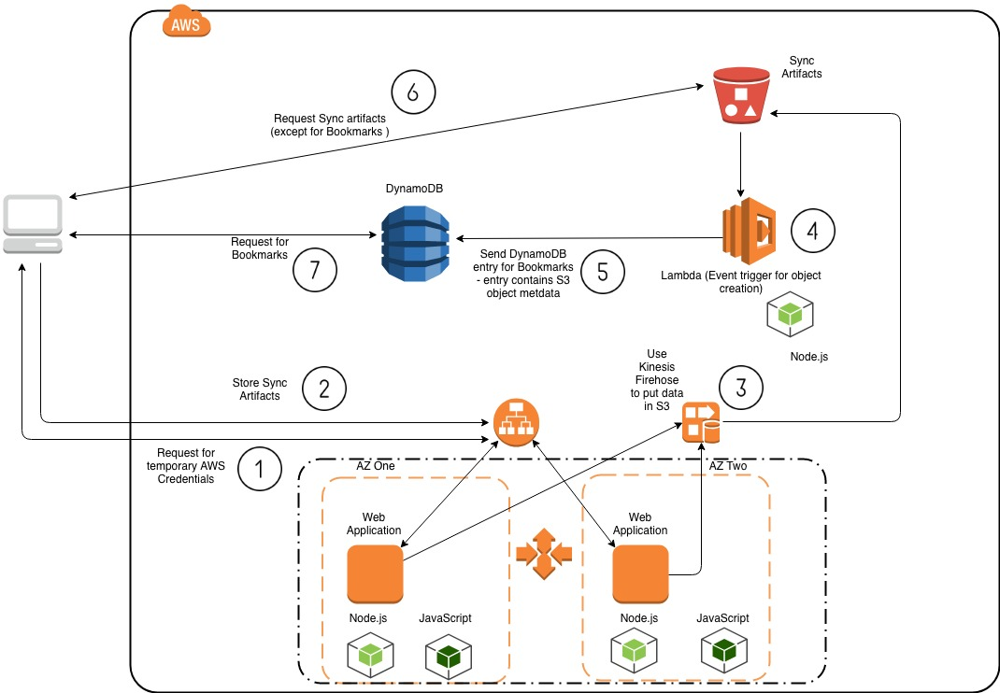

# Brave Sync Improvement Recommendations

The purpose of this document is to provide recommendations to address performance, scalability and security issues associated with the current design of Brave Sync.

## Current Design

### Bottlenecks

Bottlenecks in the current design include the following:

- Long periods of time needed for clients to sync
- Asynchronous archival of Sync artifacts to S3
- Due to the [data consistency model of S3](https://docs.aws.amazon.com/AmazonS3/latest/dev/Introduction.html#ConsistencyModel), lack of immediate read access of archived (synced) artifacts
- Managing IAM users and access (current option makes it more difficult for audits, etc.)

## Suggestions for Design Improvements

The following are suggestions for improving the design.  The improvements begin with the bare minimum to complete redesign.  All suggestions are high-level.  Further discussion should take place regarding more granular design specs. 

### Suggestion 1:  Replace SQS with DynamoDB

One of the main issues with the current implementation is the use of SQS to report back all the bookmarks of a given user's device.  Due to [SQS batch limitations](https://docs.aws.amazon.com/AWSSimpleQueueService/latest/SQSDeveloperGuide/sqs-batch-api-actions.html), the only option (due to the design of Brave Sync) is client-side buffering.  This too also has [limitations](https://docs.aws.amazon.com/AWSSimpleQueueService/latest/SQSDeveloperGuide/sqs-client-side-buffering-request-batching.html). 

A much more scalable approach would be to use [DynamoDB](https://docs.aws.amazon.com/amazondynamodb/latest/developerguide/Limits.html#default-limits-capacity-units-provisioned-throughput) to handle bookmark sync requests. S3 would still be used for other Sync artifacts. In addition, moving the EC2 instances to be part of an AutoScaling group would help with backend performance when writing to S3 when sync requests increase.

### Suggestion 2: Suggestion 1 + Using Kinesis Firehose to store sync artifacts in S3

In addition to the issue mentioned in Suggestion 1, another area that could be improved is the architecture around syncing artifacts to S3 from the EC2 instances. Currently, we are asynchronously putting items to S3.  The buffering to S3 is handled by the EC2 instances, which adds more contention for resources.  To improve this part of the architecture, [Kinesis Firehose](https://docs.aws.amazon.com/firehose/latest/dev/what-is-this-service.html) can be used to remove the potential buffering issues that will arise as more clients use Brave Sync.

### Suggestion 3: Suggestion 1 + Replace EC2 instances with AWS Lambdas + Suggestion 2

To handle the potential bottleneck of EC2 resource contention, [Lambdas can be used to handle requests coming into the ALB](https://docs.aws.amazon.com/elasticloadbalancing/latest/application/lambda-functions.html).  Leveraging lambdas as the target group to the ALB will allow for efficient handling of requests per resource consumed.

### Suggestion 4: Suggestion 1 + Suggestion 3 + [DynamoDB TTLs to archive to S3](https://aws.amazon.com/blogs/database/automatically-archive-items-to-s3-using-dynamodb-time-to-live-with-aws-lambda-and-amazon-kinesis-firehose/)

This suggestion would require more of a redesign than the previous three. The following are included for this improvement:

- Instead of writing artifacts to S3 directly, write entries to DynamoDB
- The entries would be sent to S3 upon DynamoDB TTL expiration
- Requests for artifacts < TTL would be sent to DynamoDB
- Request for artifacts > TTL would be sent to S3

This improvement would remove any contention for syncs from the client end (send/receive) as well as on the backend (ALB+Lambda).

## Redesign

Looking at the current design of Brave Sync, there are services that could help mitigate bottlenecks, provide opportunities for future features, and ease security management.

The redesign suggestion includes the following:

- use [AWS AppSync + GraphQL](https://docs.aws.amazon.com/appsync/latest/devguide/system-overview-and-architecture.html) to handle sync requests
- leverage [AWS Cognito for maintaining user authentication/authorization in AWS AppSync](https://docs.aws.amazon.com/appsync/latest/devguide/security.html#amazon-cognito-user-pools-authorization)
- use the backend design mentioned in Suggestion 4 by leveraging [DyanmoDB TTLs to archive to S3]((https://aws.amazon.com/blogs/database/automatically-archive-items-to-s3-using-dynamodb-time-to-live-with-aws-lambda-and-amazon-kinesis-firehose/))
- the Brave Sync client would also need to use the [Amplify Framework](https://aws-amplify.github.io/docs/) [to work with AWS AppSync](https://docs.aws.amazon.com/appsync/latest/devguide/building-a-client-app.html)

The redesign would definitely be a huge effort given not only the re-architecture and new services involved, but also the any new integration features that would be available.
